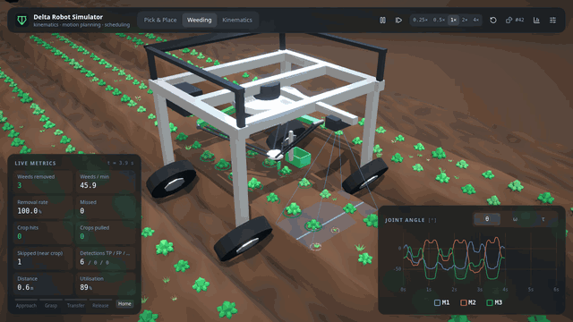
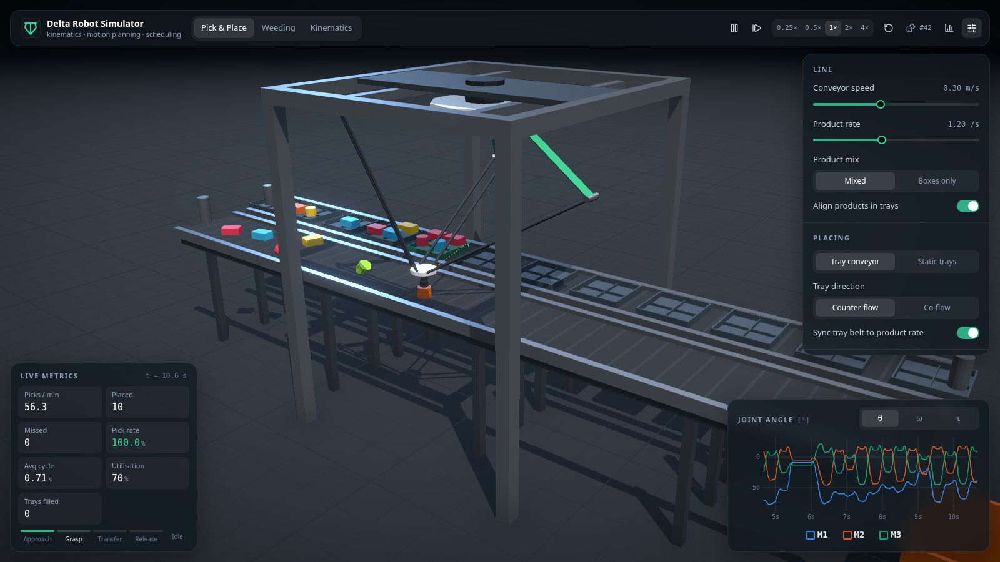
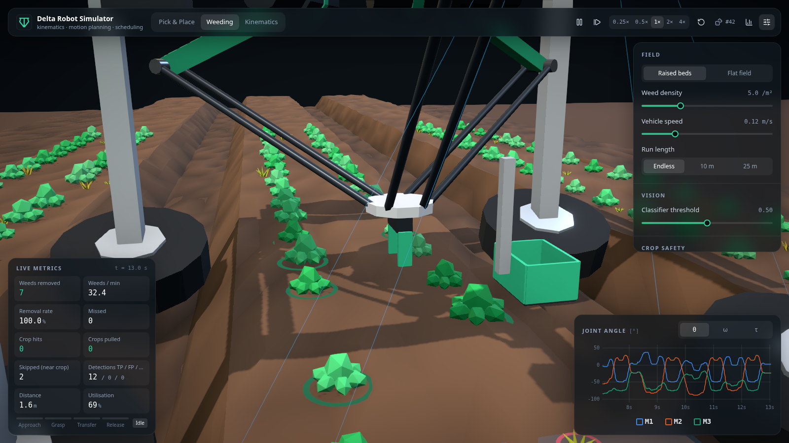
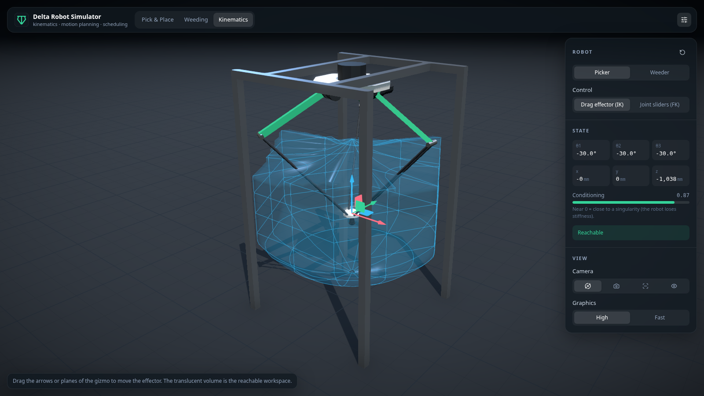

# Delta Robot Simulator

An interactive 3D simulation of a delta (parallel) robot in two industrial use cases: high-speed **pick & place** from a conveyor, and **autonomous weeding**, where a gripper-equipped robot removes weeds between crop rows while the vehicle drives over the field.

Everything runs in the browser. The kinematics, motion planning and scheduling are written from scratch in TypeScript and unit-tested. The 3D view is built with React Three Fiber.

**[▶ Live demo](https://hcdiekmann.github.io/delta/)**  ·  [Legacy version](legacy/README.md)



## Features

**Pick & place**
- Products arrive at random (Poisson process) on a moving conveyor, at random positions and orientations.
- The robot picks items while they move. It matches their velocity at contact, so there's no stop-and-go.
- Placing uses either trays on a second conveyor (co- or counter-flow) or static trays. The 4th axis rotates products so they all sit the same way in the tray.
- Live throughput, pick rate, cycle time, utilisation and tray metrics.

**Autonomous weeding**
- A vehicle carrying the robot drives at a constant speed over an endless, seeded field. There are two field presets: raised beds and a flat field.
- A simulated camera classifies plants ahead of the robot. Its noisy confidence scores produce realistic false positives and negatives, and the classifier threshold is adjustable.
- Crop safety: crops are keep-out zones and the gripper lifts and descends vertically. Weeds too close to a crop are skipped, or attempted if you choose. An independent collision check counts crop hits.
- Weeds go into a bin on the vehicle or are dropped into the furrow.
- Metrics include removal rate, weeds/min, crop hits, crops pulled after misclassification, and detection TP/FP/FN.

**Kinematics playground**
- Drag the effector with a gizmo while inverse kinematics solves live, or set the motor angles directly with forward kinematics.
- Out-of-reach targets clamp to the workspace boundary, and the panel shows why: rods can't meet, a joint limit, or a ball-joint limit.
- A conditioning indicator shows how close the robot is to a singularity.

**Across all modes**
- Toggle the reachable workspace envelope and the planned tool path.
- Live charts of joint angle, joint speed and estimated motor torque.
- Strategy benchmark: runs every scheduling strategy on the same seeds in a Web Worker and compares the results.
- Deterministic, seeded runs. All settings are stored in the URL, so a setup can be shared as a link.
- Camera modes (overview/follow, close-up, top-down, free), playback speed from 0.25× to 4×, and single-stepping.

| Pick & place | Weeding close-up | Kinematics |
| --- | --- | --- |
|  |  |  |

## Getting started

Requires Node.js 22 or newer.

```bash
npm install
npm run dev        # http://localhost:5173
```

| Script | |
| --- | --- |
| `npm run dev` | Development server with hot reload |
| `npm run build` | Type-check and build the static site into `dist/` |
| `npm run preview` | Serve the production build |
| `npm test` | Unit tests (Vitest) |
| `npm run lint` / `npm run typecheck` | ESLint / TypeScript |
| `npm run legacy` | Start the original p5.js version (run `npm --prefix legacy install` first) |

**Keyboard:** `Space` play/pause · `R` restart · `1`–`4` camera modes.

## How it works

```
src/core/      simulation core: pure TypeScript, no rendering, fully unit-tested
  kinematics/  IK, FK, Jacobian, joint and ball-joint limits, workspace, torque model
  motion/      jerk-limited profiles, arch (gate) moves, moving-target intercept
  scheduling/  reach windows and strategies (EDF, FIFO, nearest)
  robot/       task controller (state machine) and telemetry
  scenarios/   pick & place and weeding worlds
  sim/         fixed-step simulation loop
src/render/    React Three Fiber scene: robot model, conveyors, field, vehicle, camera rig
src/ui/        panels, live metrics, uPlot charts, benchmark dialog
src/state/     settings store (zustand), sim handle, URL state
```

The core never imports three.js or React (an ESLint rule enforces this). That's why the same code runs in the render loop, in the unit tests and in the benchmark worker. The render loop only *reads* the simulation state each frame. React re-renders only when settings change.

### Kinematics

The robot works in a Z-up frame with the base at the origin; leg *i* sits at *i*·120°. For a target *p*, rotate it into the leg frame, (*a*, *b*, *c*), with *a* shifted by the effector and base radii. The rod-length constraint |*P<sub>i</sub>* − *E<sub>i</sub>*(θ)| = *L* then becomes

  *A* cos θ + *B* sin θ = *C*,  *A* = 2*aU*, *B* = 2*cU*, *C* = *a*² + *b*² + *c*² + *U*² − *L*²

which has the closed-form solution θ = atan2(*B*, *A*) + acos(*C* / √(*A*² + *B*²)) (the elbow-out branch).

- **Inverse kinematics** returns the reason when a target is unreachable, instead of failing silently.
- **Forward kinematics** intersects three spheres (two planes plus a quadratic).
- **The Jacobian**, θ̇<sub>i</sub> = (*n<sub>i</sub>*·*v*) / (*n<sub>i</sub>*·*E<sub>i</sub>*′), drives the speed chart and the singularity measure.
- **The workspace** is sampled as horizontal slices by radial bisection with the full IK and limits.
- **The torque estimate** uses the common lumped-mass model: the rod masses are split between elbow and effector, and the effector force is mapped through the Jacobian transpose. It uses the original machine's masses and its 38.5:1 gearbox.

### Motion planning

- Moves are jerk-limited **double-S profiles**, combined into an industrial "gate" move. The horizontal traverse starts before the lift ends and finishes after the descent begins.
- Moving targets are caught with a **carrier + relative move** decomposition, *p*(*t*) = *r*(*t*) + *c*(*t*):
  - The carrier *c* blends the start velocity into the target velocity with a smootherstep ramp.
  - *r* is a rest-to-rest gate move.
  - The robot therefore arrives at the item's position *with the item's velocity* and zero acceleration. The move duration *T* is solved numerically.
- Picking from a conveyor and weeding from a moving vehicle are the same problem: a target moving at constant velocity in the robot frame.
- While tracking, drift between the predicted and actual target positions is blended in. This handles speed changes mid-move.

### Scheduling

- Each detected item gets a reach window [*t*<sub>in</sub>, *t*<sub>out</sub>].
- The candidates are ordered by strategy:
  - **EDF**: earliest deadline first;
  - **FIFO**: most downstream first;
  - **Nearest**: closest to the gripper.
- The controller takes the first candidate whose whole cycle is feasible. That means the intercept fits the window, every sampled point is reachable and clear of crops, and a place target exists afterwards.

### Tests

`npm test` runs 54 tests. They include:
- property-based IK/FK round trips (fast-check);
- Jacobian vs. finite differences;
- a virtual-work check of the torque model;
- profile limits and continuity;
- intercept position and velocity matching;
- workspace boundaries;
- seed determinism;
- scenario runs, e.g. "the weeder never hits a crop" and "pick & place keeps up at the default rate".

## Deployment

The app is a static site. On every push to `main`, `.github/workflows/deploy.yml` builds it and publishes it to GitHub Pages. Enable Pages once under *Settings → Pages → Source: GitHub Actions*.

To host it elsewhere, run `npm run build` and serve `dist/`. Set `BASE_PATH` if the site is served from a subpath.

## History

The original version was written with p5.js and could mirror a real Beckhoff PLC over ADS. It still lives in [`legacy/`](legacy/README.md), and the design document with the original kinematics derivation is in [`docs/DesignDocument.pdf`](docs/DesignDocument.pdf).

## License

MIT © Christian Diekmann
